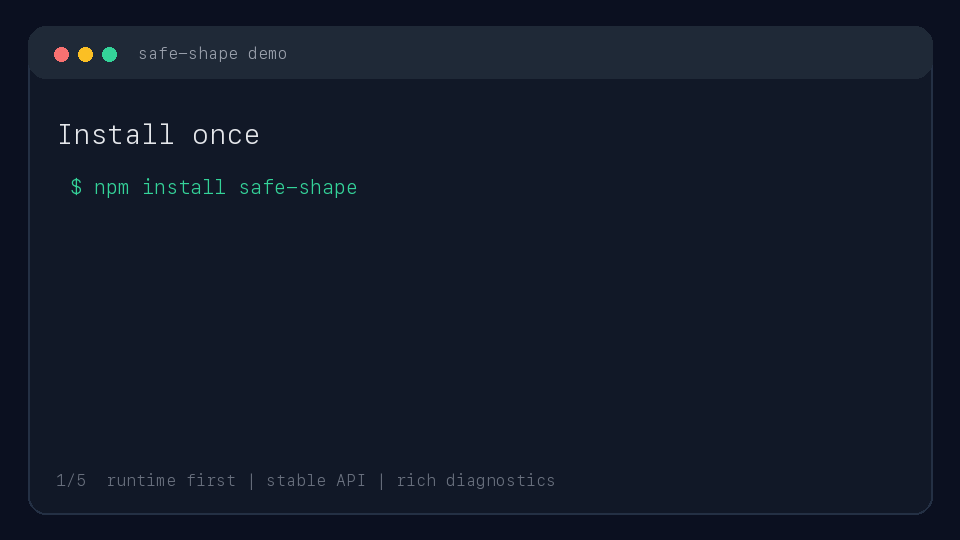

# SafeShape

Runtime contracts for TypeScript: define one schema, validate unknown input at
runtime, infer static types, and generate tooling artifacts from the same source.

[](https://www.npmjs.com/package/safe-shape)
[](package.json)
[](docs/type-system.md)
[](package.json)
[](docs/release.md)

<p align="center">
  
</p>

## Why SafeShape

TypeScript types disappear at runtime. SafeShape keeps the runtime boundary
explicit: no hidden coercion, immutable schemas, stable diagnostics, and strong
type inference from the contract you actually execute.

Use SafeShape when data crosses a trust boundary:

- API requests and responses.
- JSON files and config.
- CLI input and generated artifacts.
- Webhook payloads and integration events.
- Any `unknown` value that must become typed data.

## How It Differs From Zod

Zod is the broader validation ecosystem today. SafeShape is intentionally
narrower: it treats runtime schemas as public contracts that must stay explicit,
documented, toolable, and release-tested.

| Decision | Zod | SafeShape |
| --- | --- | --- |
| Primary goal | TypeScript-first schema validation | Runtime contract platform |
| API shape | Broad convenience surface | Conservative stable surface |
| Coercion | Rich convenience APIs, including coercion-oriented workflows | No hidden coercion; transforms are explicit |
| Tooling | Large ecosystem and built-in conversion features | First-party CLI, JSON Schema export, TypeScript generation, validation reports |
| HTTP boundaries | Usually handled through adapters or app code | First-party framework-neutral HTTP helpers |
| Release posture | Mature general-purpose library | Contract-first release gate with tests, examples, benchmarks, consumer install, audit, and pack dry-run |

Choose Zod when you need the largest ecosystem and the widest validation feature
set. Choose SafeShape when you want a smaller contract layer with explicit
runtime behavior, stable diagnostics, first-party tooling, and package boundaries
that are designed for API stability.

## Quick Start

Install the full runtime and tooling surface:

```sh
npm install safe-shape
```

Define a schema and validate unknown input:

```ts
import { number, object, string, type Infer } from "safe-shape";

const User = object({
  id: string(),
  age: number().optional(),
});

type User = Infer<typeof User>;

const result = User.safeParse({ id: "user_1", age: 42 });

if (!result.success) {
  console.error(result.error.issues);
} else {
  const user: User = result.data;
  console.log(user.id);
}
```

SafeShape validates without coercion. `{ age: "42" }` is invalid until you add an
explicit transform.

## CLI Example

SafeShape also ships a CLI. Use it to turn runtime contracts into generated
artifacts:

```sh
safe-shape --json schema export \
  --module ./dist/contracts/user.js \
  --export User \
  --schema https://json-schema.org/draft/2020-12/schema \
  --out ./dist/contracts/user.schema.json
```

```sh
safe-shape --json schema types \
  --module ./dist/contracts/user.js \
  --export User \
  --name User \
  --out ./dist/contracts/user.d.ts
```

The CLI is machine-readable under `--json`, treats validation failures as
command results, and does not require authentication.

## Release Metrics

Current stable release gate:

| Signal | Status |
| --- | --- |
| Packages | 7 publishable packages |
| Unit tests | 69 passing tests |
| Consumer install | Tarball install smoke check passes |
| Examples | Runnable examples pass |
| Security audit | 0 known vulnerabilities |
| Benchmarks | 5 runtime parse scenarios |
| Package dry run | `npm pack --workspaces --dry-run` passes |

Sample local benchmark run on Node.js `v20.10.0` / macOS arm64:

| Scenario | Throughput |
| --- | ---: |
| Primitive string `safeParse` valid | 9,107,731 ops/sec |
| Object user `safeParse` valid | 269,899 ops/sec |
| Union event `safeParse` valid | 38,447 ops/sec |
| Array users `safeParse` valid | 11,389 ops/sec |
| Object user `safeParse` invalid | 78,017 ops/sec |

Benchmark results are execution evidence, not fixed release thresholds. Re-run
them locally with:

```sh
npm run build
npm run benchmarks:check
```

## Packages

Install `safe-shape` when you want the complete public surface from one package.
Import only what each module needs:

```ts
import { object, string, validateSchema } from "safe-shape";
```

Use narrower packages when you want strict dependency boundaries:

| Package | Purpose |
| --- | --- |
| `safe-shape` | Umbrella package that re-exports runtime and tooling APIs |
| `@safe-shape/core` | Runtime schemas, parsing, diagnostics, and type inference |
| `@safe-shape/http` | Framework-neutral HTTP boundary helpers |
| `@safe-shape/json-schema` | JSON Schema export |
| `@safe-shape/typescript` | TypeScript declaration generation |
| `@safe-shape/validation` | JSON-friendly validation reports |
| `@safe-shape/cli` | Command-line tooling |

## Design Principles

- Runtime first.
- API stability over feature count.
- Immutable schemas and parse results.
- Rich diagnostics with stable issue paths.
- Correctness before performance.
- Performance before convenience.
- No magic and no hidden coercion.

## Documentation

- [Project integration](docs/integration.md)
- [Core API](docs/api/core.md)
- [CLI API](docs/api/cli.md)
- [HTTP helpers](docs/api/http.md)
- [JSON Schema export](docs/api/json-schema.md)
- [TypeScript generation](docs/api/typescript.md)
- [Validation reports](docs/api/validation.md)
- [Benchmarks](docs/benchmarks.md)
- [Release workflow](docs/release.md)

## Local Development

```sh
npm install
npm run build
npm run test
npm run release:check
```

Use the built CLI without a global install:

```sh
npm run cli:doctor
```

Runnable examples live in [examples](examples/README.md):

```sh
npm run examples:check
```

## Project Status

SafeShape is on the `1.0.x` stable API release line. The release gate covers
metadata checks, build, typecheck, tests, examples, benchmarks, consumer tarball
installation, npm audit, and package dry-run.
